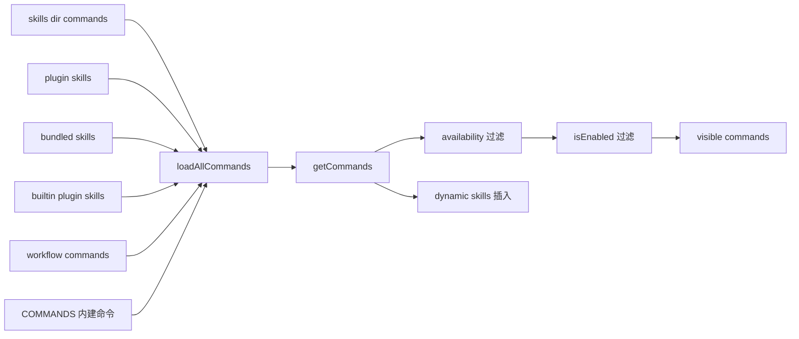
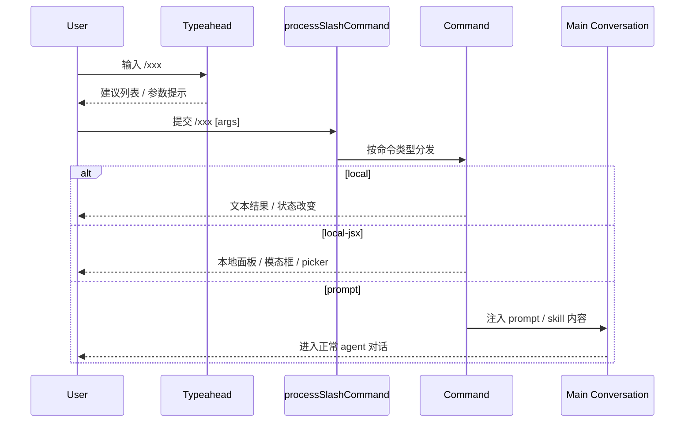

# Refinex Code 的 `/` 斜杠命令不是快捷键集合，而是 CLI 的统一控制平面

Type: Deep-Dive Reference  
Scope: 基于 2026-04-07 对当前仓库源码与运行时 `getCommands()` 结果的实测，说明 Refinex Code CLI `/` 斜杠命令的注册来源、补全机制、执行模型，以及当前环境下真实可见的命令目录。  
Prerequisite Knowledge: `src/commands.ts`、CLI REPL 基础概念、`prompt/local/local-jsx` 三类命令模型  
Reading Time: 16 min  
Central Argument: Refinex Code 的 `/` 斜杠命令不是零散命令面板，而是一层把会话控制、环境配置、代码审查、扩展集成与 skill 调用统一起来的控制平面；要复用它，必须同时理解注册、补全、执行与可见性四条链路。

## Writing Brief

ARGUMENT: Refinex Code 的 `/` 斜杠命令是 CLI 的统一控制平面，而不是一组彼此独立的快捷操作。

Anchors:

- 2026-04-07 通过 `enableConfigs()` + `getCommands(process.cwd())` 实测导出 73 条 slash commands，其中 68 条当前可见。
- 当前可见命令分布为 `local=9`、`local-jsx=42`、`prompt=17`。
- 当前可见 `prompt` 命令里，`11` 条来自用户安装 skills，`6` 条来自内建 prompt commands。
- `/` 空输入时，补全会优先展示最近使用的 prompt commands，然后再混排 builtin、user、project、policy、other。
- `/add-dir` 与 `/resume` 拥有专门的参数补全逻辑；`Tab` 只补全，`Enter` 才会补全并执行。

Reader Belief Audit:

The target reader probably believes `/` 只是一个命令列表。This document will overturn that belief by showing 命令列表只是最终 UI，真正决定行为的是命令装配、来源标记、补全排序、执行类型和可见性过滤。

Scope Boundary Declaration:

- 不覆盖当前未启用 feature flags 下的全部命令细节，因为这些能力并不构成当前环境的真实可见面。
- 不把 MCP 运行时注入的 model-only skills 当作用户可直接输入的 slash commands，因为它们不走同一条 `getCommands()` 路径。
- 不展开 desktop 右侧主面板的具体实现，因为本文聚焦 CLI 本体，desktop 只应复用这里的控制面事实。

VOICE: Mechanism Autopsy。本文要解释的是命令体系如何被组装、展示和执行，重点是机制与边界，不是产品宣讲。

## Annotated Outline

### 1. 先给结论

先直接给出判词和统计，避免读者把本文误解成“命令清单抄录”。

### 2. 命令从哪里来

解释 `COMMANDS()`、skills、plugins、workflows、dynamic skills 如何汇入 `getCommands()`，这是命令目录真实来源。

### 3. `/` 输入时到底发生了什么

解释 typeahead、Fuse 排序、source 标记、参数 hint 与特殊命令补全，让输入框能力有可复用的行为模型。

### 4. 命令执行模型

区分 `prompt`、`local`、`local-jsx` 三类命令的执行与反馈方式，说明为什么同样是 slash command，用户体验完全不同。

### 5. 当前环境命令目录

给出可直接复用的、按类别整理的完整命令表，而不是一张无法扫描的大表。

### 6. 边界、风险与后续阅读

指出这套体系最容易被误读的地方，方便后续 desktop `/` 能力设计不踩偏差。

## 1. 先给结论

如果只保留一个结论，那就是这一句：Refinex Code 的 `/` 斜杠命令是一层统一控制平面。它把四类本来分散的能力压进同一个入口里：

- 会话控制：如 `/clear`、`/compact`、`/resume`、`/rewind`
- 运行时配置：如 `/model`、`/permissions`、`/theme`、`/sandbox`
- 集成与扩展：如 `/mcp`、`/plugin`、`/skills`、`/ide`
- prompt/skill 调度：如 `/review`、`/security-review`、`/harness-feat`

这意味着 desktop 想复用 `/`，不能只抄“候选列表长什么样”，而要复用下面四件事：

- 命令是如何被注册和过滤出来的
- 补全是如何排序和渐进披露的
- 不同命令类型执行后会进入哪种交互
- 当前用户环境里到底有哪些命令真实可见

当前环境快照如下：

| 指标 | 数量 | 说明 |
| --- | ---: | --- |
| 总命令数 | 73 | `getCommands()` 返回的完整命令集合 |
| 当前可见命令 | 68 | `isHidden` 为 `false` 的命令 |
| `local` | 9 | 直接执行本地逻辑并返回文本/状态 |
| `local-jsx` | 42 | 打开本地面板、模态框或交互 UI |
| `prompt` | 17 | 把 slash command 扩展成 prompt/skill 内容后进入主对话链路 |
| 内建 prompt | 6 | `/init`、`/review` 等 |
| 已安装 skills | 11 | 当前用户 settings 里加载的 skills |
| 隐藏命令 | 5 | 不默认出现在补全里，通常是内部/弃用/feature-gated |

## 2. 命令从哪里来

### 2.1 注册总入口

命令装配的总入口在 `src/commands.ts`：

- `COMMANDS()` 聚合内建命令
- `getSkills(cwd)` 拉入 `skills` 目录、plugin skills、bundled skills、builtin plugin skills
- `getWorkflowCommands(cwd)` 在 feature flag 打开时引入 workflow commands
- `getPluginCommands()` 拉入插件命令
- `getCommands(cwd)` 最后统一做可见性过滤，并插入 dynamic skills

源码上的装配顺序是：

Least obvious element:

`getCommands()` 并不只返回 `src/commands.ts` 里硬编码的命令；用户安装 skills、插件技能、bundled skills 都会混进同一个 slash command 空间里。所以 UI 层如果自己写死命令清单，最终一定会和 CLI 真相漂移。

### 2.2 可见性不是静态的

命令的可见性由两层机制共同决定：

- `availability`：账号/提供商是否满足，例如 `/desktop`、`/usage`、`/upgrade`
- `isEnabled()`：feature flags、环境、平台条件是否允许

当前环境里带 `availability` 的可见命令有：

- `/desktop`: `claude-ai`
- `/fast`: `claude-ai`, `console`
- `/install-github-app`: `claude-ai`, `console`
- `/install-slack-app`: `claude-ai`
- `/upgrade`: `claude-ai`
- `/usage`: `claude-ai`

这也是为什么“别人的 CLI 有这个命令，我这里没有”经常不是 bug，而是可见性条件不同。

### 2.3 当前环境的 prompt 命令来源

当前 17 条可见 `prompt` 命令全部来自两类来源：

| 来源 | 数量 | 说明 |
| --- | ---: | --- |
| `builtin` | 6 | CLI 自带 prompt 命令 |
| `skills` | 11 | 从用户 settings 加载的本地 skills |

当前环境没有可见的 plugin prompt commands、bundled prompt skills、workflow commands。文档里必须把这一点写清楚，否则会把“代码支持的潜在来源”误写成“当前用户马上能用的命令”。

## 3. `/` 输入时到底发生了什么

### 3.1 `/` 空输入不是简单的字母排序

`src/utils/suggestions/commandSuggestions.ts` 里，`generateCommandSuggestions()` 对裸 `/` 做了专门排序：

1. 先取最近使用的 prompt commands，最多 5 个
2. 再按类别拼接 builtin commands
3. 再拼接 user commands
4. 再拼接 project commands
5. 再拼接 policy commands
6. 最后才是 other commands

这说明 `/` 面板本质上是“最近使用 + 分层来源”的混合视图，不是字母表。

### 3.2 带字母搜索时的排序规则

当用户输入 `/rev` 这类前缀时，CLI 用 `Fuse.js` 做模糊搜索，但排序不是完全交给 Fuse，而是二次重排：

1. 精确命令名匹配
2. 精确 alias 匹配
3. 命令名前缀匹配
4. alias 前缀匹配
5. 描述文本的模糊匹配

随后再用 Fuse score 和 skill usage score 做细排。结果是：名字和 alias 始终比 description 更重要。

### 3.3 补全列表不是只显示 description

`formatDescriptionWithSource()` 会把 `prompt` 命令的来源折进 description 里：

- plugin command 会显示插件来源
- bundled skill 会显示 `(bundled)`
- user/project/policy settings 来源会带来源标记

所以同名 prompt command 即使来自不同来源，也不会在 typeahead 阶段被强行去重。源码明确保留了“同名但不同来源”同时出现的可能性。

### 3.4 参数态时，命令列表会让位给参数引导

`src/hooks/useTypeahead.tsx` 的行为可以归纳成一句话：

- 还在输命令名时，展示命令列表
- 命令名确定且进入参数态后，停止展示命令列表，改展示 `argumentHint` 或渐进式参数 hint

当前环境里有 17 条可见命令带 `argumentHint`，例如：

- `/add-dir <path>`
- `/resume [conversation id or search term]`
- `/plan [open|<description>]`
- `/sandbox exclude "command pattern"`

当前 17 条可见 `prompt` 命令里，没有任何一条定义了 `argNames`。这意味着在本环境下，slash command 参数提示主要依赖 `argumentHint`，而不是多段渐进式参数模板。

### 3.5 两个有特殊补全逻辑的命令

当前源码明确为两个命令提供了特殊参数补全：

- `/add-dir`
  - 参数态走目录补全
  - `Tab` 可以把目录补齐并继续下钻
- `/resume`
  - 参数态可以按会话标题搜索历史 session
  - 选择后会把标题回填成真正的 session id 输入

这两个特例非常重要，因为它们说明 slash command typeahead 不是只有“命令名补全”，还支持命令级别的专用参数补全器。

### 3.6 键盘语义

键盘行为在 `useTypeahead.tsx` 里非常明确：

- `Up` / `Down`: 在建议列表中循环选择
- `Tab`: 接受当前建议，但不执行命令
- `Enter`: 对命令建议会“接受并执行”
- `/add-dir` 的目录建议在命令上下文里，`Enter` 会让提交逻辑继续走 slash command，而不是把目录建议强塞进输入框

换句话说，CLI 把“补全”和“执行”明确分成两步，`Tab` 和 `Enter` 语义不同。

## 4. 命令执行模型

slash command 的三种类型定义在 `src/types/command.ts`：

| 类型 | 本质 | 用户感知 | 典型场景 |
| --- | --- | --- | --- |
| `prompt` | 生成 prompt/skill 内容，再进入主对话链路 | 像“调用一个能力” | `/review`、`/security-review`、`/harness-feat` |
| `local` | 直接执行本地逻辑，返回文本或状态 | 更像立即动作 | `/clear`、`/compact`、`/release-notes` |
| `local-jsx` | 加载本地 UI 组件或面板 | 更像打开控制面板/模态框 | `/mcp`、`/plugin`、`/model` |

执行路径可概括为：

### 4.1 `prompt` 命令的边界

在当前环境中，17 条可见 `prompt` 命令全部是：

- `context: inline`
- `userInvocable: true`
- `disableModelInvocation: false`

也就是说，它们都会把自身展开进当前对话，而不是默认开独立子代理。

### 4.2 `local-jsx` 里有一批“即时命令”

当前可见且 `immediate: true` 的 `local-jsx` 命令有：

- `/btw`
- `/color`
- `/exit`
- `/mcp`
- `/plugin`
- `/rename`
- `/status`
- `/hooks`
- `/sandbox`

这些命令可以绕过队列等待，直接在当前 REPL 里打开对应 UI 或立即执行局部交互。

### 4.3 未知 slash command 的处理

`processSlashCommand.tsx` 对未知 `/xxx` 的处理不是一刀切：

- 如果看起来像命令名，会回 `Unknown skill: xxx`
- 如果更像普通文本或路径，可能退回普通 prompt 流程

这是一个很关键的 UX 保护：它避免把所有以 `/` 开头的输入都硬解释成错误命令。

## 5. 当前环境的完整命令目录

### 5.1 会话与上下文控制

| 命令 | 类型 | 作用 | 常见用法 | 后续引导 / 交互 |
| --- | --- | --- | --- | --- |
| `/add-dir` | `local-jsx` | 把新目录加入工作上下文 | `/add-dir ~/repo` | 参数态有目录补全，适合多仓协作 |
| `/branch` | `local-jsx` | 从当前会话分支出新会话 | `/branch fix-auth` | alias 为 `/fork`，进入会话分支创建流程 |
| `/btw` | `local-jsx` | 在不中断主线程的情况下问侧问题 | `/btw 这个错误码是谁定义的？` | 即时命令，保留主会话上下文 |
| `/clear` | `local` | 清空当前对话上下文 | `/clear` | 立即执行，不走模型 |
| `/compact` | `local` | 压缩对话，保留摘要 | `/compact` 或 `/compact 重点保留设计决策` | 释放上下文窗口但保留摘要 |
| `/copy` | `local-jsx` | 复制上一条或倒数第 N 条回复 | `/copy`、`/copy 3` | 更像即时操作，目标是剪贴板 |
| `/context` | `local` / `local-jsx` | 查看上下文占用 | `/context` | 交互式 REPL 中显示彩色网格；非交互场景退化为文本输出 |
| `/diff` | `local-jsx` | 查看未提交改动与逐轮 diff | `/diff` | 打开 diff 面板，适合回顾本轮编辑 |
| `/export` | `local-jsx` | 导出当前会话 | `/export notes.md` | 可导出到文件或剪贴板 |
| `/rename` | `local-jsx` | 重命名当前会话 | `/rename slash command 研究` | 即时命令，弹出重命名交互 |
| `/resume` | `local-jsx` | 恢复历史会话 | `/resume abc123`、`/resume slash` | 参数态支持按会话标题搜索并选择 |
| `/rewind` | `local` | 回滚代码和/或会话到历史点 | `/rewind` | alias 为 `/checkpoint`，属于危险恢复动作 |
| `/tasks` | `local-jsx` | 查看后台任务 | `/tasks` | alias 为 `/bashes`，打开任务列表与状态管理 |

### 5.2 配置、模型与输入行为

| 命令 | 类型 | 作用 | 常见用法 | 后续引导 / 交互 |
| --- | --- | --- | --- | --- |
| `/color` | `local-jsx` | 设置当前会话 prompt bar 颜色 | `/color blue` | 即时命令，适合多会话区分 |
| `/config` | `local-jsx` | 打开配置面板 | `/config` | alias 为 `/settings`，是大量 UI 配置的总入口 |
| `/effort` | `local-jsx` | 设置模型 effort level | `/effort high` | 带枚举 hint，修改推理强度 |
| `/fast` | `local-jsx` | 切换 fast mode | `/fast on` | 仅特定账户/提供商可见 |
| `/memory` | `local-jsx` | 编辑 memory files | `/memory` | 打开记忆文件编辑与管理界面 |
| `/model` | `local-jsx` | 切换当前模型 | `/model gpt-5.4` | 打开模型选择或按参数直达 |
| `/permissions` | `local-jsx` | 管理允许/拒绝的工具规则 | `/permissions` | alias 为 `/allowed-tools`，是工具权限的总控入口 |
| `/plan` | `local-jsx` | 开启 plan mode 或查看当前计划 | `/plan open`、`/plan 实现 slash docs` | 进入计划面板或用描述启动计划 |
| `/privacy-settings` | `local-jsx` | 查看隐私设置 | `/privacy-settings` | 进入隐私相关配置 UI |
| `/provider` | `local-jsx` | 切换 Anthropic / Codex provider | `/provider` | 管理模型提供商与路由 |
| `/sandbox` | `local-jsx` | 管理命令沙箱/排除规则 | `/sandbox exclude \"git status\"` | 即时命令，直达沙箱配置 |
| `/theme` | `local-jsx` | 切换主题 | `/theme` | 打开主题切换器 |
| `/vim` | `local` | 切换 Vim / Normal 编辑模式 | `/vim` | 立即生效，改变输入行为 |
| `/hooks` | `local-jsx` | 查看 hooks 配置 | `/hooks` | 即时命令，检查工具事件 hooks |
| `/terminal-setup` | `local-jsx` | 安装 `Shift+Enter` 新行快捷键 | `/terminal-setup` | 更偏一次性环境设置 |

### 5.3 连接、账号与扩展

| 命令 | 类型 | 作用 | 常见用法 | 后续引导 / 交互 |
| --- | --- | --- | --- | --- |
| `/agents` | `local-jsx` | 管理 agent 配置 | `/agents` | 打开 agent 配置与选择界面 |
| `/desktop` | `local-jsx` | 把当前会话续接到 Desktop | `/desktop` | alias 为 `/app`，需要账户满足可见性条件 |
| `/ide` | `local-jsx` | 管理 IDE 集成 | `/ide`、`/ide open` | 查看 IDE 状态或打开集成操作 |
| `/install-github-app` | `local-jsx` | 安装 GitHub Actions 集成 | `/install-github-app` | 适合给仓库接入 GitHub App |
| `/install-slack-app` | `local` | 安装 Slack App | `/install-slack-app` | 直接执行安装流程 |
| `/login` | `local-jsx` | 登录 Anthropic 账号 | `/login` | 进入登录流程 |
| `/logout` | `local-jsx` | 登出 Anthropic 账号 | `/logout` | 进入登出确认/执行流程 |
| `/mcp` | `local-jsx` | 管理 MCP servers | `/mcp`、`/mcp enable foo` | 即时命令，可直达启停服务器动作 |
| `/mobile` | `local-jsx` | 显示移动端下载二维码 | `/mobile` | alias 为 `/ios`、`/android` |
| `/plugin` | `local-jsx` | 管理插件 | `/plugin` | aliases 为 `/plugins`、`/marketplace`，即时打开插件面板 |
| `/reload-plugins` | `local` | 激活待生效插件变更 | `/reload-plugins` | 直接刷新当前 session 的插件状态 |
| `/remote-env` | `local-jsx` | 配置 teleport 默认远端环境 | `/remote-env` | 更偏远端开发环境管理 |
| `/skills` | `local-jsx` | 列出可用 skills | `/skills` | 打开技能列表，是 slash skill 空间的可视入口 |

### 5.4 状态、诊断与运营

| 命令 | 类型 | 作用 | 常见用法 | 后续引导 / 交互 |
| --- | --- | --- | --- | --- |
| `/doctor` | `local-jsx` | 诊断安装与配置问题 | `/doctor` | 打开环境检查面板 |
| `/exit` | `local-jsx` | 退出 REPL | `/exit` | alias 为 `/quit`，即时命令 |
| `/feedback` | `local-jsx` | 提交反馈 | `/feedback`、`/bug` | 可携带简短报告文本 |
| `/help` | `local-jsx` | 查看帮助与命令列表 | `/help` | 提供 slash command discoverability 的兜底入口 |
| `/release-notes` | `local` | 查看版本更新说明 | `/release-notes` | 直接输出 release notes |
| `/stats` | `local-jsx` | 查看使用统计与活跃度 | `/stats` | 偏账户/使用分析 |
| `/status` | `local-jsx` | 查看版本、模型、账号、连通性和工具状态 | `/status` | 即时命令，是运行状态总览入口 |
| `/stickers` | `local` | 订购贴纸 | `/stickers` | 明显偏运营/彩蛋能力 |
| `/upgrade` | `local-jsx` | 升级到 Max | `/upgrade` | 账户可见性受限 |
| `/usage` | `local-jsx` | 查看 plan usage limits | `/usage` | 账户可见性受限，偏订阅与额度信息 |

## 6. 内建 `prompt` 命令

这 6 条命令不会只打开一个面板，而是会把 slash command 展开成 prompt 内容，让主对话链路继续跑。

| 命令 | 作用 | 常见用法 | 后续引导能力 |
| --- | --- | --- | --- |
| `/init` | 初始化 `AGENTS.md` 与代码库文档化入口 | `/init` | 把“扫描代码库并生成 AGENTS / skills / hooks”的长 prompt 注入主会话；新版逻辑还会通过提问逐步确定产出范围 |
| `/pr-comments` | 获取 GitHub PR 评论 | `/pr-comments` | 把获取 PR 评论的任务交给主代理，适合进入 review/triage 流程 |
| `/review` | 代码审查当前 PR 或指定 PR | `/review`、`/review 123` | prompt 明确要求 agent 使用 `gh pr list/view/diff` 获取上下文并输出审查意见 |
| `/security-review` | 对当前分支做安全审查 | `/security-review` | 会先把 `git status`、`git log`、`git diff` 注入 prompt，再要求 agent 做高置信安全审查与误报过滤 |
| `/statusline` | 设置 CLI 状态栏 UI | `/statusline` | 进入一个“修改本地设置以配置状态栏”的能力路径，不是单纯信息展示 |
| `/insights` | 生成会话分析报告 | `/insights` | 延迟加载会话分析模块，再把“分析 session”任务交给主对话链路 |

需要特别注意两点：

- `/review` 明确是本地 review 路径，源码里把远端 `ultrareview` 作为另一条命令分开处理。
- `/security-review` 的 prompt 本身已经内置了安全审查范围、误报过滤规则和输出格式约束，因此它不是“普通 review + 安全标签”，而是单独设计的审查工作流。

## 7. 当前环境安装的 skills

这些命令都属于 `prompt` 型 slash commands，但来源不是 CLI 内建，而是用户 settings 里装载的 skills。它们会直接占据 `/skill-name` 命名空间。

### 7.1 Harness Engineering 相关

| 命令 | 作用 | 典型输入 | 后续引导能力 |
| --- | --- | --- | --- |
| `/harness-bootstrap` | 为仓库搭建/补齐 Harness 控制面 | `/harness-bootstrap 初始化 Harness` | 读取 AGENTS、docs、plan 模板与检查脚本，建立 agent-first 基线 |
| `/harness-feat` | 用 Harness 流程推进新功能与结构化重构 | `/harness-feat 任务：实现 slash 文档` | 会先重写任务、跑 preflight、建 active plan、分 slice 执行并归档 |
| `/harness-fix` | 用 Harness 流程处理 bug / 回归 / 事故 | `/harness-fix 修复 TUI 空白` | 强调复现、证据、最小修复与回归保护 |
| `/harness-garden` | 审计并修复 Harness 漂移 | `/harness-garden 检查 docs 索引漂移` | 聚焦控制面文档、清单与 managed 文件修正 |

### 7.2 文档与知识工作流

| 命令 | 作用 | 典型输入 | 后续引导能力 |
| --- | --- | --- | --- |
| `/tech-writing` | 生成高强度技术写作内容 | `/tech-writing 写一篇架构设计说明` | 要求先建立 central argument、anchors、outline，再写正文 |
| `/tech-rewrite` | 基于已有材料重写技术文档 | `/tech-rewrite 重写这份糟糕的 ADR` | 把源材料当事实源，而不是写作模板 |
| `/openai-docs` | 用官方文档回答 OpenAI 产品/API 问题 | `/openai-docs 比较最新模型` | 优先走官方 docs MCP，强调 up-to-date 与 citation |

### 7.3 Office 文档工作流

| 命令 | 作用 | 典型输入 | 后续引导能力 |
| --- | --- | --- | --- |
| `/office-docx` | 处理 `.docx` 文档 | `/office-docx 生成报告` | 指向 Word 文档创建、读取、编辑、排版工作流 |
| `/office-pdf` | 处理 PDF | `/office-pdf 合并这两个 PDF` | 指向 PDF 提取、合并、拆分、OCR 等工作流 |
| `/office-pptx` | 处理演示文稿 | `/office-pptx 更新这个 deck` | 指向 slide 读写、改版、合并、讲稿等工作流 |
| `/office-xlsx` | 处理表格文件 | `/office-xlsx 清洗这个 CSV` | 指向 `.xlsx/.csv/.tsv` 读写、清洗、格式化与公式工作流 |

这 11 条 skills 有三个共同特征：

- 全部 `userInvocable: true`
- 全部 `context: inline`
- 全部直接出现在 slash command 空间，而不是藏在二级面板里

这也是 desktop 输入框实现多 skill 选择时最该复用的事实基础。

## 8. 隐藏 / 非默认公开命令

以下命令在当前环境中已注册，但不默认出现在 slash typeahead 中：

| 命令 | 类型 | 说明 | 文档中的定位 |
| --- | --- | --- | --- |
| `/cost` | `local` | 查看当前 session 成本与耗时 | 可作为内部/补充命令参考 |
| `/heapdump` | `local` | 把 JS heap dump 到桌面 | 明显偏内部调试 |
| `/output-style` | `local-jsx` | 已弃用，改用 `/config` | 只做兼容性附录 |
| `/rate-limit-options` | `local-jsx` | 限流时的选项面板 | feature-gated / 场景性命令 |
| `/passes` | `local-jsx` | 分享免费试用周 | 产品运营向能力 |

补全逻辑对隐藏命令还有一个细节：如果用户输入了隐藏命令的精确名字，系统仍可能把它前置到搜索结果。这是为了支持精确显式调用，而不是为了默认曝光它们。

## 9. 对 desktop `/` 输入框最有价值的复用结论

如果目标是把 CLI `/` 行为迁移到 desktop 输入框，这里最值得复用的不是 UI 皮肤，而是下面这 6 条行为公约：

1. 命令源必须来自运行时装配，而不是前端手写清单。
2. 裸 `/` 优先显示最近使用的 prompt/skill，再显示 builtin 与其他来源。
3. 命令名、alias 前缀必须比 description 模糊匹配优先级更高。
4. 进入参数态后，列表要及时退场，让位给参数 hint 或专用补全器。
5. `/add-dir`、`/resume` 这类命令级参数补全器必须允许定制，而不是强行走统一补全。
6. `Tab` 只补全不执行，`Enter` 才补全并提交，这个行为差异不能丢。

## 10. Failure Modes / Production Risks

这套体系最容易踩的坑不是实现 bug，而是“文档或 UI 误建模”：

- 只从 `src/commands.ts` 抄命令，会漏掉用户 skills、插件命令和动态扩展。
- 只看某一次截图，会忽略 `availability`、`isEnabled()`、账号状态和 feature flag 导致的可见性差异。
- 把 `prompt` 命令也当成“打开面板”的交互，会把 `/review`、`/harness-feat` 这种能力型命令做错。
- 忽略 `local` / `local-jsx` / `prompt` 三分法，会导致提交、队列、即时执行和结果展示全部偏掉。
- 忽略“参数态让位给 hint”的规则，会让命令补全在用户已经进入参数输入后仍持续抢焦点。

## 11. Known Limitations / When This Doesn't Apply

本文结论有明确边界：

- 这是 2026-04-07 当前环境的实测快照，不是对所有账号、所有 feature flag、所有插件安装组合的承诺。
- `getCommands()` 不覆盖 MCP 运行时 model-only skills；如果未来要写“SkillTool 视角的能力总表”，需要单独把 `AppState.mcp.commands` 纳入研究。
- 非交互环境和正常 REPL 对同名命令的实现可能不同，最典型的例子是 `/context`。
- 当前环境没有可见 workflow commands、plugin prompt skills、bundled prompt skills；如果后续环境变了，命令目录应该重新导出，而不是手改文档。

## 12. Closing

把 CLI 的 `/` 命令体系研究到源码层之后，可以很清楚地看到：真正稳定的不是某个弹层长什么样，而是“命令从哪里来、怎么排、什么时候切到参数态、最后走哪条执行链路”。Refinex Code 的 `/` 之所以值得复用，不在于它有 68 条命令，而在于它把本地动作、配置面板、审查流程和 skills 统一进了同一个控制平面，并且已经用可见性、排序、参数提示和执行类型把这层平面做得足够可扩展。

## What to Read Next

- `src/commands.ts`：如果你要回答“命令为什么会出现在 `/` 里”，这是最短路径。
- `src/utils/suggestions/commandSuggestions.ts` 与 `src/hooks/useTypeahead.tsx`：如果你要实现 desktop 输入框 `/` 补全，这两处是排序、参数 hint 与键盘语义的核心。
- `src/utils/processUserInput/processSlashCommand.tsx`：如果你要区分“打开面板”和“进入 skill/prompt”，这里是执行分发与边界处理的核心。
